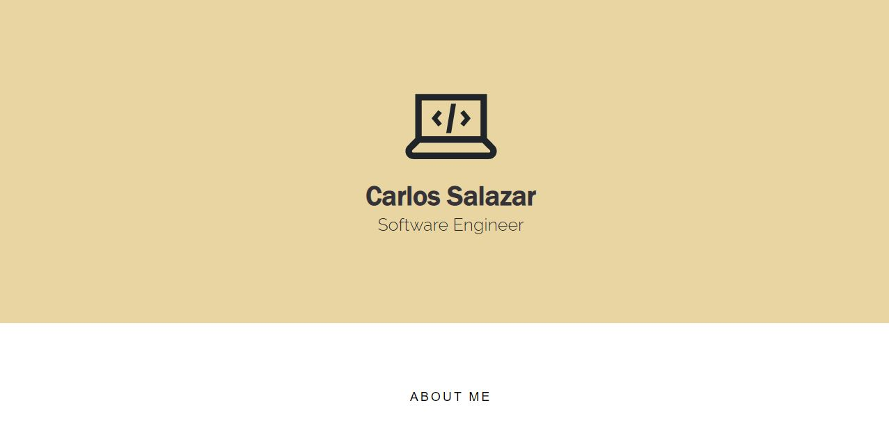

<h1 align="center">Portfolio Website</h1>

<h3 align="left">About</h3>

Welcome to my portfolio page. This is where the user can browse through my portfolio page and view everything about me and my work as a Computer Scientist.

<h3>Live Site</h3>

View it <a href="https://carlossalazar2000.github.io/"><strong>here</strong></a>

 

<pre>
⭐ Portfolio template was designed and created by <a href="https://github.com/Dorota1997/react-frontend-dev-portfolio">Dorota1997</a>
You can find her and all the amazing people 
who contributed to the project in the link
</pre>